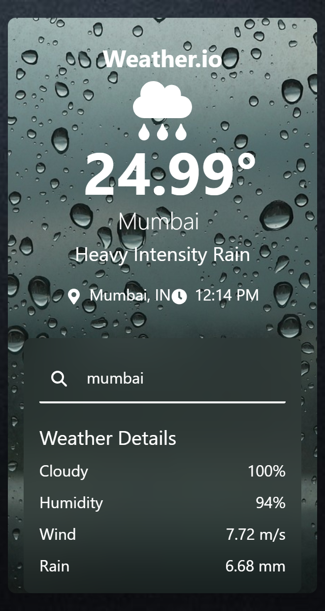

# Weather-web-app/Weather.io

using Next Js

Weather.io is a sleek, modern weather application built with Next.js and Tailwind CSS. It provides real-time weather information for any city, displaying current conditions, temperature, humidity, wind speed, and more. The application is designed to be responsive, offering a seamless experience on both desktop and mobile devices.

## Features

- **Real-time Weather Data**: Fetches and displays real-time weather information for any city.
- **Responsive Design**: Optimized for both desktop and mobile views.
- **Dynamic Backgrounds**: Changes background based on current weather conditions.
- **Weather Details**: Provides additional weather details such as humidity, wind speed, and rain levels.
- **Search Functionality**: Allows users to search for weather information by city name.


## Screenshots



## Getting Started

Follow these instructions to set up and run the project on your local machine.

### Prerequisites

Ensure you have the following installed:

- Node.js (>= 14.x)
- npm (>= 6.x) or yarn (>= 1.x)

### Installation

1. Clone the repository:

    ```sh
    git clone https://github.com/your-username/weather-io.git
    ```

2. Navigate to the project directory:

    ```sh
    cd weather-io
    ```

3. Install the dependencies:

    ```sh
    npm install
    ```

    or

    ```sh
    yarn install
    ```

### Running the Application

To start the development server, run:

```sh
npm run dev
